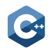

# Hey 👋, I'm Paras Aghija

I am a versatilist and easily adapt to different hats (Full Stack Web Developer 🌐, App Developer 📱, Blockchain enthusiast) depending on what the project requires. I love exploring new tech stack 💻 and leveraging them to build cool stuffs 🛠️.
 
 

## 🔨 Languages and Tools:

<code></code>
<code></code>
<code></code>
<code></code>
<code></code>
<code></code>
<code></code>
<code></code>
<code></code>
<code></code>
<code></code>
<code></code>
<code></code>
<code></code>
<code></code>
<code></code>
<code></code>
<code></code>
<code></code>
 

## 📊 My Github Stats

    
    

 
<b>Note:</b> Top languages is only a metric of the languages my public code consists of and doesn't reflect experience or skill level.
